# Installatie 
Security onion biedt meerdere installaties , in deze installatie wordt enkel security onion standalone besproken. Heb je interresse in een andere installatie van security dan kun je meer informatie vinden op [Security Onion installaties ] (https://docs.securityonion.net/en/2.4/architecture.html).

## Hardware requirements
Voor de standalone installatie zijn volgende requirements nodig: 


Bovenstaande requirements zijn noodzakelijk anders zal de installatie falen. Meer resources zijn altijd wenselijk ze zullen de SIEM betere prestaties doen geven.

## installatie proces
Onderstaande afbeeldingen tonen alle stappen die u moet doorlopen om Security Onion succesvol te installeren. Houd er rekening mee dat het installatieproces van Security Onion lang kan duren en sommige instellingen alleen wijzigbaar zijn met herinstallatie.

1. 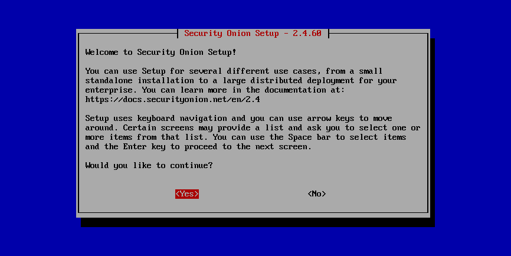
   - Kies "yes".

2. 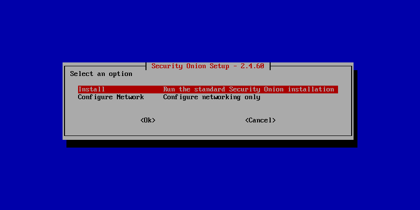
   - Kies "install".

3. 
   - Kies voor standalone voor deze installatie.
   - Opmerking: Deze versie kan zelfstandig draaien in een productieomgeving en heeft de meeste features actief. Enkele features, zoals een Honeypot, zijn hier niet inbegrepen.

4. 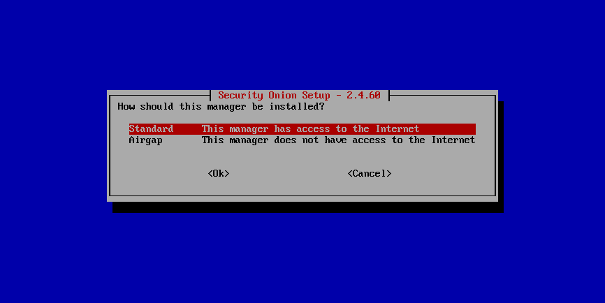
   - Kies "standard".

5. 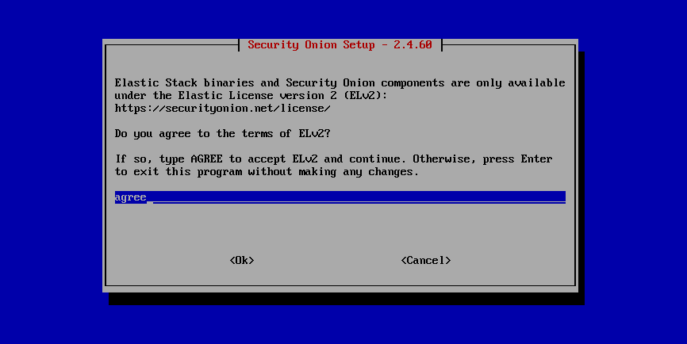
   - Typ "agree".

6. 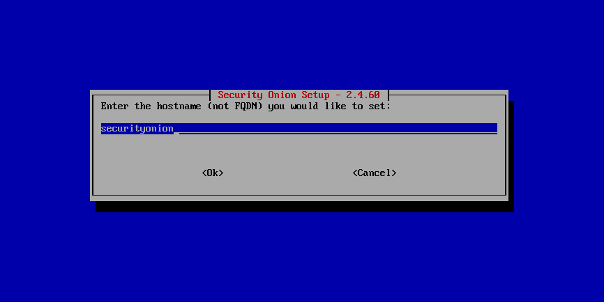
   - Kies een FQDN voor de Security Onion-installatie. Let op: deze FQDN kan na installatie niet meer gewijzigd worden!

7. 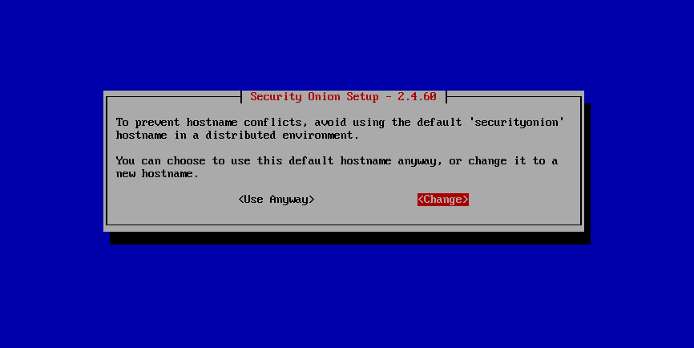
   - Deze waarschuwing verschijnt alleen als de standaard FQDN wordt gekozen. Kies "Use Anyway" indien gewenst.

8. 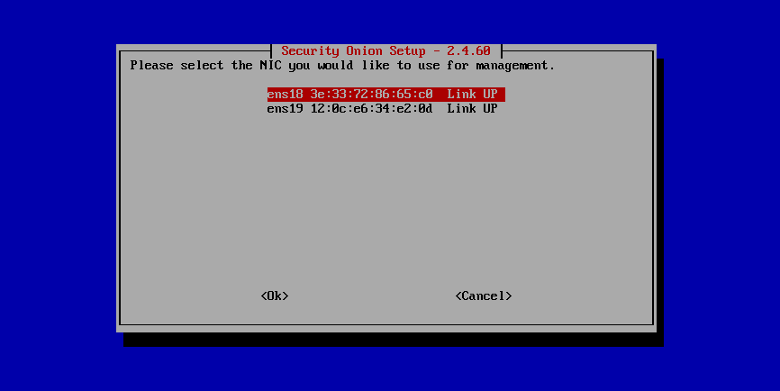
   - Kies een NIC voor de managementinterface.

9. 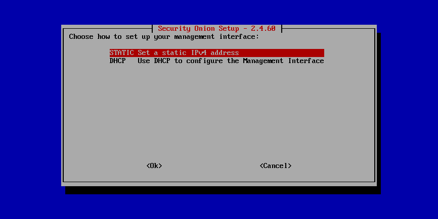
   - Kies "static IP". Let op: dit IP wordt ook gebruikt in alle docker containers en is niet meer wijzigbaar!

10. 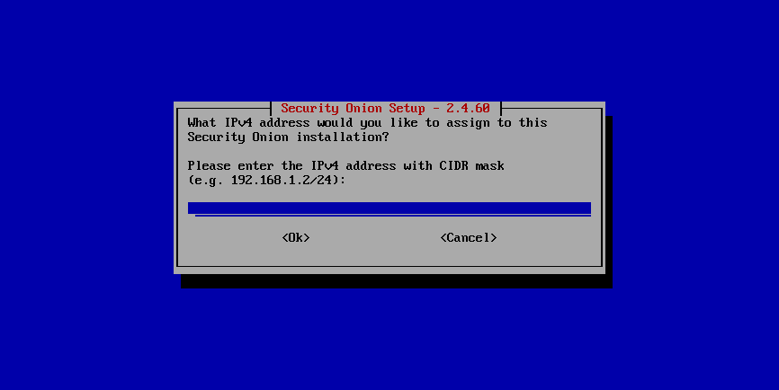
    - Kies een IP met subnetmask voor Security Onion.

11. 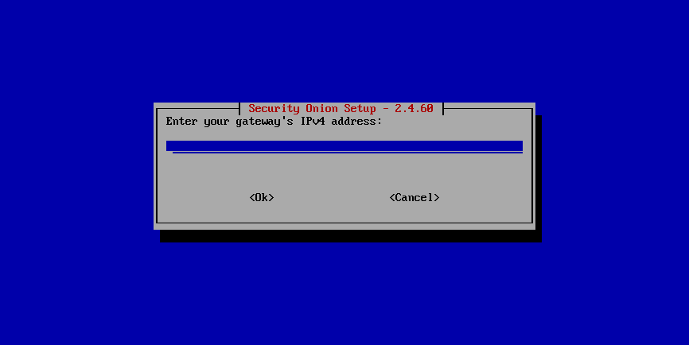
    - Kies een standaard gateway.

12. 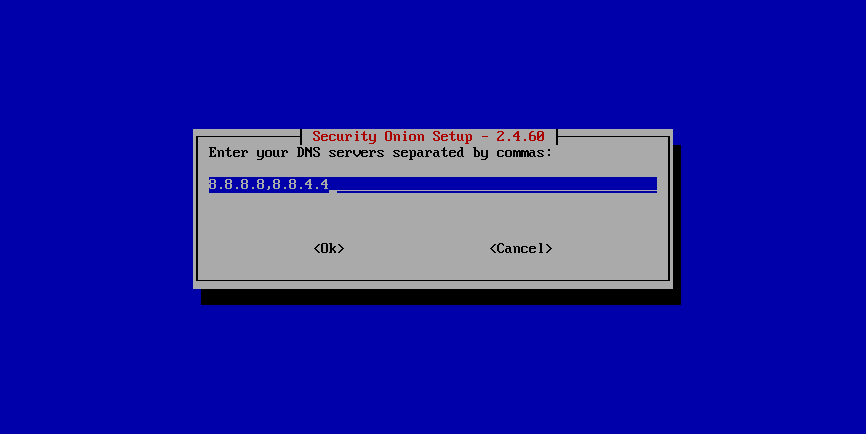
    - Kies één of meerdere DNS-servers die Security Onion moet gebruiken.

13. 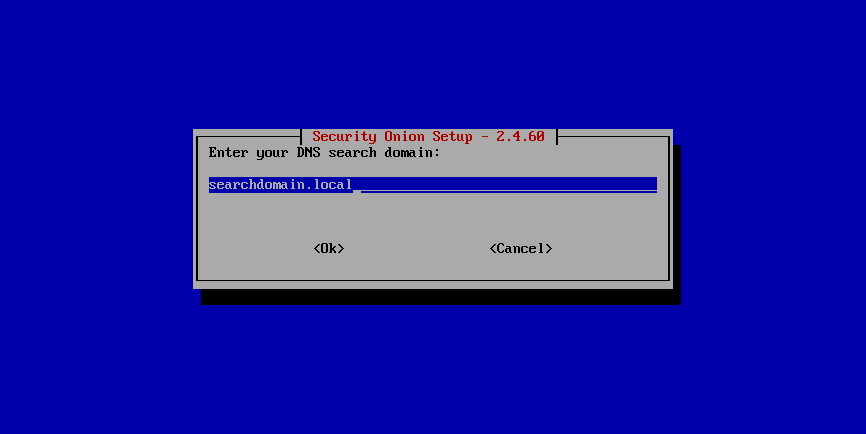
    - Kies een DNS-suffix die Security Onion moet gebruiken.

14. 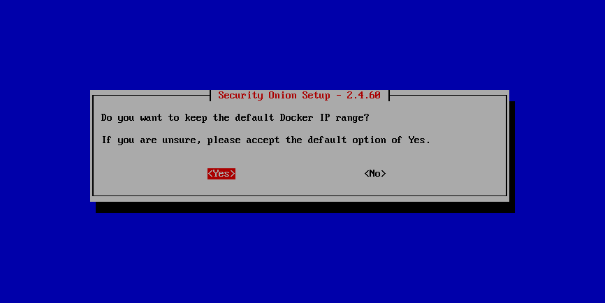
    - Kies "yes".

15. 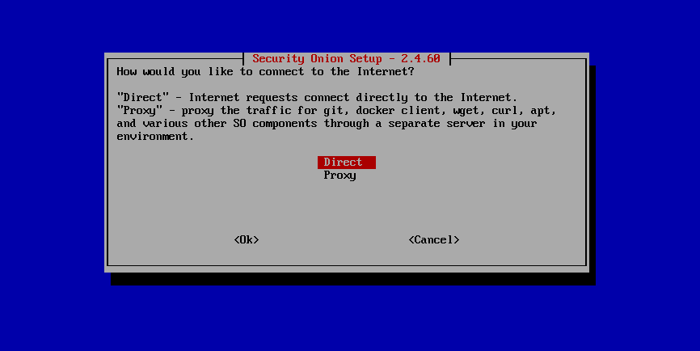
    - Kies "Direct" als u geen proxy wilt gebruiken.

16. 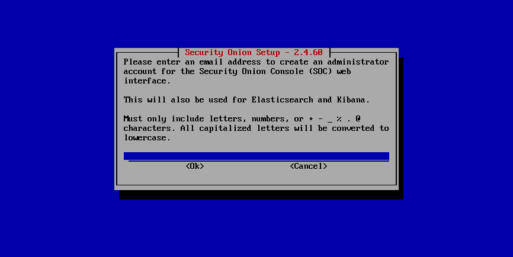
    - Kies een e-mailadres dat als root account wordt aangemaakt voor het Security Onion-dashboard en Kibana. Dit hoeft geen bestaand e-mailadres te zijn. Let op: het rootaccount kan niet gewijzigd worden!

17. 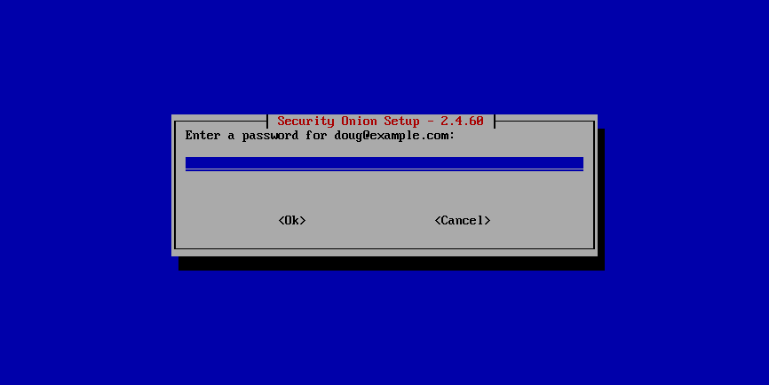
    - Kies een wachtwoord voor het rootaccount.

18. 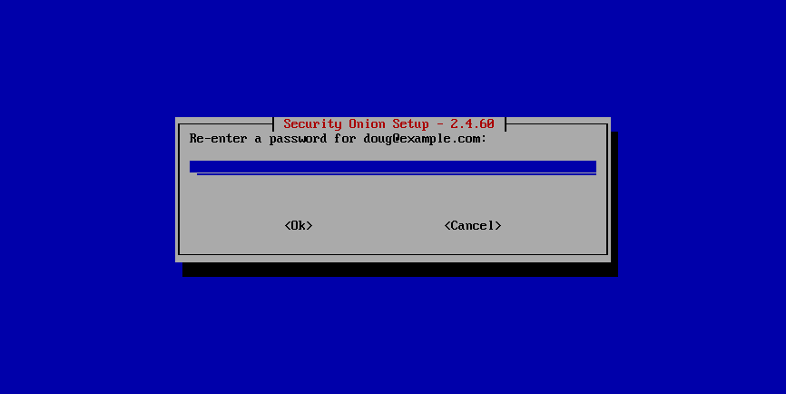
    - Bevestig het wachtwoord voor het rootaccount.

19. 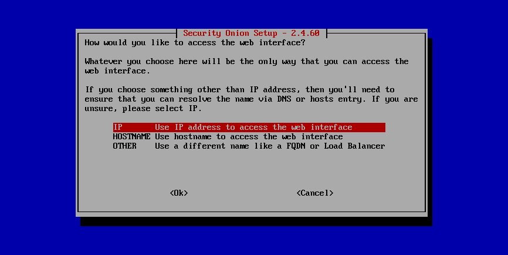
    - Kies hoe u Security Onion wilt bereiken. Let op: als u 'hostname' kiest, moet er een DNS-server zijn die het IP van Security Onion kan vertalen. Security Onion moet ook deze DNS-server ingesteld hebben!

20. 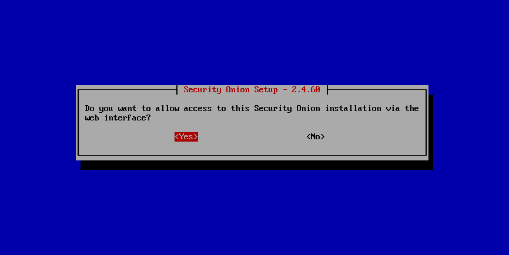
    - Kies "yes".

21. 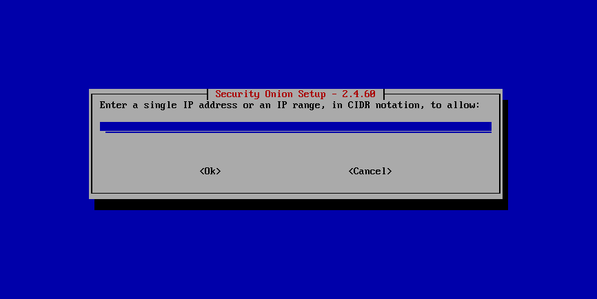
    - Kies een IP-range die toegang heeft tot het Security Onion-dashboard. Kies 0.0.0.0/0 als elk IP-adres toegang mag hebben tot dit dashboard.

22. 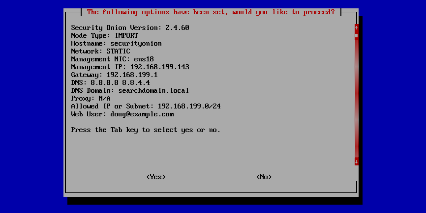
    - Controleer de samenvatting en kies "OK".

23. 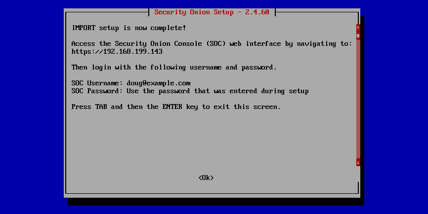
    - Kies "OK".

24. 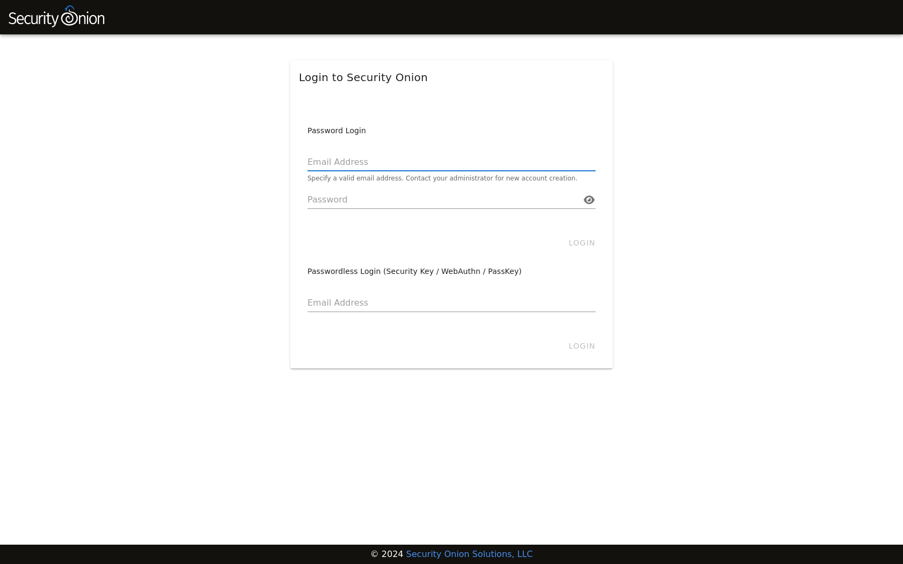
    - Navigeer naar het gekozen IP/hostname via de browser. Log in met het aangemaakte rootaccount.

25. 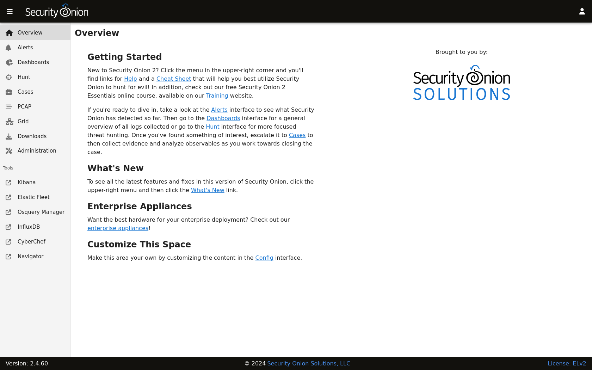
    - Als de installatie succesvol is, zou u het bovenstaande scherm moeten zien na het inloggen.


----
# Firewall
## configuratie firewall terminal

## configuratie firewall Security Onion Dashboard

----
# Elastic Agents
## Deployen Van Agents
Het Deployen van agents op hosts en endpoints gebeurd via een elastic agent install bestand. Voor elk Operating System bestaat er andere installer. 
Deze installers moet je via het SOC-dashboard gedowload worden en vervolgens uitgevoerd als administrator op windows of als root op linux/MacOS. 
Ook is het aangeraden op een geschikte hostname te kiezen voor het apparaat , want de agent gebruikt de hostname van de host als naam in de SIEM. 
De installatie kan Zowel manueel als automatisch , de automatische install gebeurd via ansible.

Naast het installeren van de agents op elke gewenste host , is het ook belangrijk om de firewall rules van de SIEM goed te zetten. 
Doe je dit niet dan zal de agent niet bereikbaar zijn.

## Verwijderen Van Agents
Moest er foutieve agents zijn gedeployed op een endpoints/host , dan kun je die op onderstaande manier verwijderen. Dit wordt aangeraden aangezien de agents nogal veel resources gebruiken zelfs als ze geen connectie hebben met de SOC. 

### Windows

1. **Open een PowerShell-prompt als Administrator**: Rechtsklik op het PowerShell-pictogram en selecteer "Uitvoeren als administrator".

2. **Voer vanuit de PowerShell-prompt het volgende commando uit**:
   ```shell
   C:\"Program Files"\Elastic\Agent\elastic-agent.exe uninstall
   ```

### Linux 


1. Open een terminalvenster.

2. Voer het volgende commando uit om het Elastic Agent verwijderingsproces te starten:
   ```bash
   sudo /opt/Elastic/Agent/elastic-agent uninstall
   ```
3. Voer je beheerderswachtwoord in wanneer daarom wordt gevraagd (let op: je ziet mogelijk geen tekens terwijl je het wachtwoord invoert, maar het wordt wel geregistreerd).

### MacOs

Hier zijn de stappen voor het verwijderen van Elastic Agent op macOS met behulp van het `sudo` commando:

1. Open de Terminal. Dit kun je vinden in de map 'Programma's' onder 'Hulpprogramma's', of je kunt het zoeken met Spotlight (Cmd + Spatie en typ "Terminal").

2. Voer het volgende commando in en druk op Enter:
   ```bash
   sudo /Library/Elastic/Agent/elastic-agent uninstall
   ```

3. Voer je beheerderswachtwoord in wanneer daarom wordt gevraagd (let op: je ziet mogelijk geen tekens terwijl je het wachtwoord invoert, maar het wordt wel geregistreerd).


## Herstarten Van Agents
Moesten er agents in de fleet server een andere state hebben dan healty kun je altijd proberen de agents een keer de restarten. Bij dsync kunnen er af en toe state problemen optreden een restart zou dit moeten fixen. 

### Windows

1. **Open een PowerShell-prompt als Administrator**: Rechtsklik op het PowerShell-pictogram en selecteer "Uitvoeren als administrator".

2. **Voer vanuit de PowerShell-prompt het volgende commando uit**:
   ```shell
   C:\"Program Files"\Elastic\Agent\elastic-agent.exe restart
   ```

### Linux 


1. Open een terminalvenster.

2. Voer het volgende commando uit om het Elastic Agent verwijderingsproces te starten:
   ```bash
   sudo /opt/Elastic/Agent/elastic-agent restart
   ```
3. Voer je beheerderswachtwoord in wanneer daarom wordt gevraagd (let op: je ziet mogelijk geen tekens terwijl je het wachtwoord invoert, maar het wordt wel geregistreerd).


### MacOs

Hier zijn de stappen voor het verwijderen van Elastic Agent op macOS met behulp van het `sudo` commando:

1. Open de Terminal. Dit kun je vinden in de map 'Programma's' onder 'Hulpprogramma's', of je kunt het zoeken met Spotlight (Cmd + Spatie en typ "Terminal").

2. Voer het volgende commando in en druk op Enter:
   ```bash
   sudo /Library/Elastic/Agent/elastic-agent restart 
   ```

3. Voer je beheerderswachtwoord in wanneer daarom wordt gevraagd (let op: je ziet mogelijk geen tekens terwijl je het wachtwoord invoert, maar het wordt wel geregistreerd).

## Verwijderen van agents uit Fleet
In Kibana bevindt zich een Fleet Server, waar alle ingezette agents en hun status worden weergegeven. Je kunt hier naartoe navigeren via het Security Onion-dashboard en vervolgens op "Elastic Fleet" klikken. Als je agents in Fleet hebt die niet langer actief moeten zijn, volg dan deze eenvoudige stappen:

1. Ga naar de agent die je wilt stoppen.
2. Klik op de drie bolletjes om de instellingen van de agent te openen.
3. Kies "Unenroll agent".

Na deze stappen is de agent niet langer actief in de Fleet Server.

----
# Agent Policy's
Een policy is een soort standaard met regels die je kunt toevoegen aan Elastic Agents die geïnstalleerd zijn op de end-points binnen een netwerkomgeving. 
De policy bepaalt welke gegevens de agent zal verzamelen en zal terugsturen naar het centraal management platform. 
Elke Elastic agent policy heeft een set van integrations. Deze integrations bepalen welke data er zal worden opgehaald uit elke Elastic agent.

## Aanmaken en instellen van Elastic Agent Policies
Op het security onion dashboard, druk op het navigatiemenu aan de linkerzijde. Onder tools druk op ‘Elastic Fleet’. Dit zal je rechtstreeks brengen naar de Elastic Fleet.
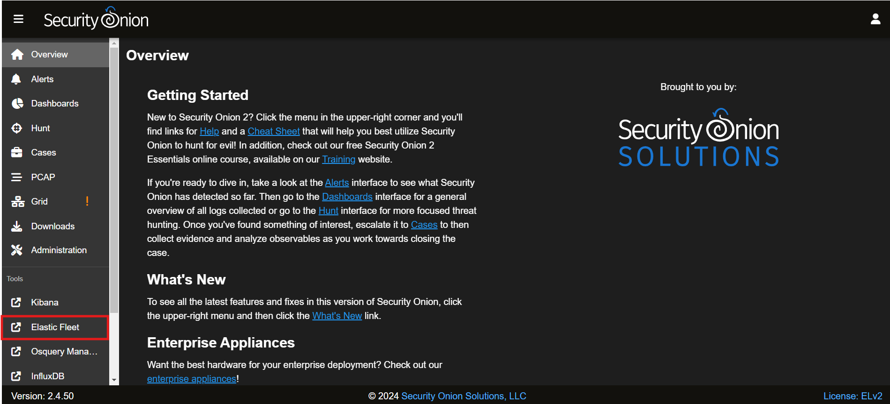
Dit is het centrale management platform dat gebruikt wordt voor het bedienen van de Elastic agents. Op het scherm zijn hier alle agents te zien die in het netwerk zijn geïnstalleerd. 
Ga naar agent policies, hier kunt u alle reeds aangemaakte agent policies vinden.

1. Druk op Create agent policy
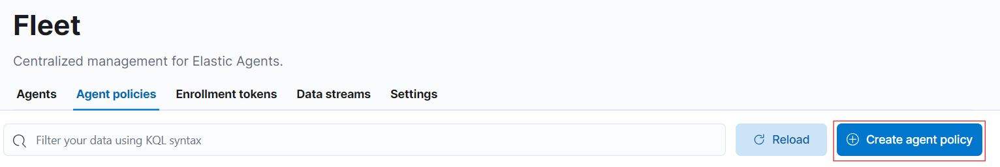
2. Geef de gewenste naam aan de agent policy (bv: Windows policy, Linux policy,etc..)
3. Onder advanced options kunt u nog een omschrijving toevoegen naar wens. De andere opties stelt u in naarmate uw toebehoren. In onze situatie hebben wij gekozen voor de default instellingen.
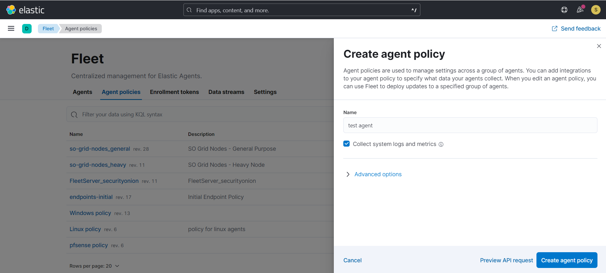

### pfsense

### cisco


----
# Certificaten
## Instellen van Certificaten

----
# ansible scripts

----
# manueel updaten

----
# SSH
## manueel toevoegen ssh keys

## ssh config

----
# Known Issue's


