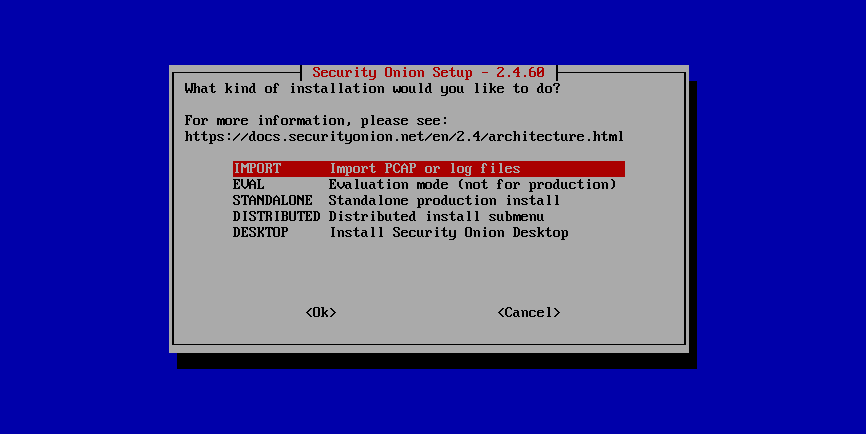
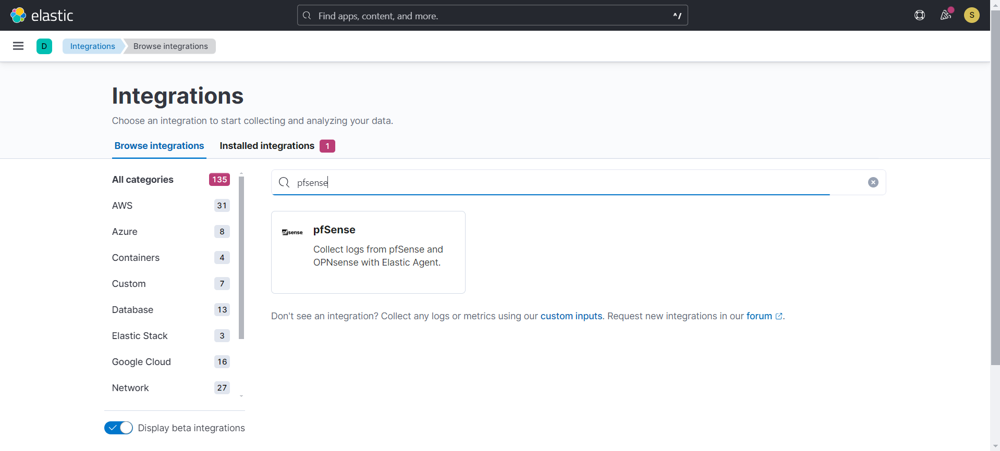
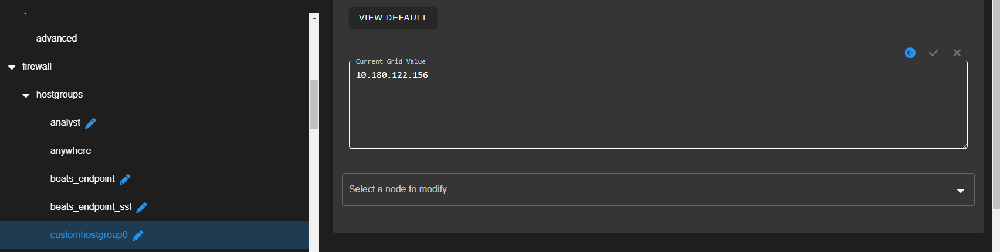

# Installatie 
Security onion biedt meerdere installaties , in deze installatie wordt enkel security onion standalone besproken. Heb je interresse in een andere installatie van security dan kun je meer informatie vinden onder
[Security Onion installaties](https://docs.securityonion.net/en/2.4/architecture.html).

## Hardware requirements
Voor de standalone installatie zijn volgende requirements nodig: 


Bovenstaande requirements zijn noodzakelijk anders zal de installatie falen. Meer resources zijn altijd wenselijk ze zullen de SIEM betere prestaties doen geven.
Requirements voor andere installaties hier te vinden onder [Security Onion requirements](https://docs.securityonion.net/en/latest/hardware.html).

## Installatie proces
Onderstaande afbeeldingen tonen alle stappen die u moet doorlopen om Security Onion succesvol te installeren. Houd er rekening mee dat het installatieproces van Security Onion lang kan duren en sommige instellingen alleen wijzigbaar zijn met herinstallatie.


   - Kies "yes".


   - Kies "install".


   - Kies voor standalone voor deze installatie.
   - Opmerking: Deze versie kan zelfstandig draaien in een productieomgeving en heeft de meeste features actief. Enkele features, zoals een Honeypot, zijn hier niet inbegrepen.


   - Kies "standard".


   - Typ "agree".


   - Kies een FQDN voor de Security Onion-installatie. Let op: deze FQDN kan na installatie niet meer gewijzigd worden!


   - Deze waarschuwing verschijnt alleen als de standaard FQDN wordt gekozen. Kies "Use Anyway" indien gewenst.


   - Kies een NIC voor de managementinterface.


   - Kies "static IP".
   - Let op: dit IP wordt ook gebruikt in alle docker containers en is niet meer wijzigbaar!


   - Kies een IP met subnetmask voor Security Onion.
     


   - Kies een standaard gateway.


   - Kies één of meerdere DNS-servers die Security Onion moet gebruiken.


   - Kies een DNS-suffix die Security Onion moet gebruiken.


   - Kies "yes".


   - Kies "Direct" als u geen proxy wilt gebruiken.

 
   - Kies een e-mailadres dat als root account wordt aangemaakt voor het Security Onion-dashboard en Kibana.
   - Dit hoeft geen bestaand e-mailadres te zijn. Let op: het rootaccount kan niet gewijzigd worden!


   - Kies een wachtwoord voor het rootaccount.


   - Bevestig het wachtwoord voor het rootaccount.


   - Kies hoe u Security Onion wilt bereiken.
   - Let op: als u 'hostname' kiest, moet er een DNS-server zijn die het IP van Security Onion kan vertalen. Security Onion moet ook deze DNS-server ingesteld hebben!


   - Kies "yes".


   - Kies een IP-range die toegang heeft tot het Security Onion-dashboard. Kies 0.0.0.0/0 als elk IP-adres toegang mag hebben tot dit dashboard.


   - Controleer de samenvatting en kies "OK".


   - Kies "OK".


   - Navigeer naar het gekozen IP/hostname via de browser. Log in met het aangemaakte rootaccount.


   - Als de installatie succesvol is, zou u het bovenstaande scherm moeten zien na het inloggen.


----
# Firewall
## configuratie firewall terminal
Tijdens de installatie van Security Onion heeft Docker in IP-tables een aantal firewallregels aangemaakt. Aan deze regels moet niets aangepast worden. Echter is er ook een firewalld-service aanwezig op de Security Onion waarin de regels van IP-tables niet aanwezig zijn die standaard actief is. Dit kan voor problemen zorgen daarom wordt deze service best gestopt en gedisabled.

### Commando's

```bash
# Stop de firewalld-service
sudo systemctl stop firewalld

# Schakel de firewalld-service uit zodat deze niet opnieuw start bij een reboot
sudo systemctl disable firewalld
```

## configuratie firewall Security Onion Dashboard
Bij Het Security Onion Dashboard is er wel bijkomende firewall configuratie nodig indien je wenst dat bepaalde docker containers instaat zijn om te communiceren met de SIEM. Default staat dit op een deny-all. 

1. Ga naar Administration.
2. Klik op Configuration.
3. Zoek firewall in de lijst en open de opties.
4. Open de optie hostgroups.
5. Zoek de functie waarvan je de firewall rules wilt wijzigen.
6. Klik op deze functie.
7. Vul Het IP of IP-range in die toegang mogen hebben tot deze functie. 
   - Indien de IP-range niet gekend is of eender welk IP aan deze functie mag vul 0.0.0.0/0 in.
   - Let op bij een IP-range moet het submask worden ingevuld in prefix-notatie zoals bijvoorbeeld /24.
8. Druk op het vinkje om de configuratie op te slaan.

Bij onderstaande afbeelding wordt de firewall configuratie aangepast van elastic agents.


Meer uitleg over alle firewall functies is te vinden onder [Firewall Info](https://docs.securityonion.net/en/latest/firewall.html#).


----
# Elastic Agents
## Deployen Van Agents
Het Deployen van agents op hosts en endpoints gebeurd via een elastic agent install bestand. Voor elk Operating System bestaat er andere installer. 

De installatie kan zowel manueel als automatisch , de automatische install gebeurd via ansible of intune.

### Manuele installatie
De installers moeten via het SOC-dashboard (https://IP-SOC/#/downloads) worden gedownload en vervolgens worden uitgevoerd als administrator op windows of als root op linux/MacOS. 

Ook is het aangeraden om een geschikte hostname te kiezen voor het apparaat , want de agent gebruikt de hostname van de host als naam binnen de SIEM oplossing. 

### Automatisch

#### Intune
De installatie via intune staat volledig beschreven in de [intune handleiding](../Intune/intune.md), zo kan de al bestaande infrastructuur makkelijk worden geintegreerd in de SIEM.

#### Ansible
Als hosts beschikbaar zijn via ssh vanuit 1 ansible client dan is het installeren van de elastic agent heel simpel met 1 script. Dit vereist wel dat je op de ansible client het script lokaal hebt gedownload op een gekende locatie met liefst een duidelijk onderscheidbare naam.

Scripts om een Elastic Agent in te stellen via ansible zien er als volgt uit:

      # Install windows script
      hosts: windows_hosts
      become: true

      tasks: 
      - name: Script installeren
        script: /path/naar/windowselasticagentinstaller.exe
---
      # Install Linux script
      hosts: linux_hosts
      become: true

      tasks: 
      - name: Script installeren
        script: /path/naar/linuxelasticagentinstaller.exe
Het pad naar de installer wordt vervangen door het werkelijke pad op de ansible client.

### Deployed
Eenmaal het script is geinstalleerd op de hosts zullen de logs binnen beginnen komen op de SIEM. Let wel op dat er steeds een verbinding moet zijn met de SIEM anders zal de install falen, aangezien de installer geen verbinding kan maken met de SIEM.

Naast het installeren van de agents op elke gewenste host , is het ook belangrijk om de firewall rules van de SIEM goed te zetten. 
Doe je dit niet dan zal de agent niet bereikbaar zijn.

Meer informatie omtrent Elastic agents is hier te vinden onder [Elastic agents info](https://docs.securityonion.net/en/latest/elastic-fleet.html).

## Verwijderen Van Agents
Moest er foutieve agents zijn gedeployed op een endpoints/host , dan kun je die op onderstaande manier verwijderen. Dit wordt aangeraden aangezien de agents nogal veel resources gebruiken zelfs als ze geen connectie hebben met de SOC. 

### Windows

1. **Open een PowerShell-prompt als Administrator**: Rechtsklik op het PowerShell-pictogram en selecteer "Uitvoeren als administrator".

2. **Voer vanuit de PowerShell-prompt het volgende commando uit**:
   ```shell
   C:\"Program Files"\Elastic\Agent\elastic-agent.exe uninstall
   ```

### Linux 


1. Open een terminalvenster.

2. Voer het volgende commando uit om het Elastic Agent verwijderingsproces te starten:
   ```bash
   sudo /opt/Elastic/Agent/elastic-agent uninstall
   ```
3. Voer je beheerderswachtwoord in wanneer daarom wordt gevraagd (let op: je ziet mogelijk geen tekens terwijl je het wachtwoord invoert, maar het wordt wel geregistreerd).

### MacOs

Hier zijn de stappen voor het verwijderen van Elastic Agent op macOS met behulp van het `sudo` commando:

1. Open de Terminal. Dit kun je vinden in de map 'Programma's' onder 'Hulpprogramma's', of je kunt het zoeken met Spotlight (Cmd + Spatie en typ "Terminal").

2. Voer het volgende commando in en druk op Enter:
   ```bash
   sudo /Library/Elastic/Agent/elastic-agent uninstall
   ```

3. Voer je beheerderswachtwoord in wanneer daarom wordt gevraagd (let op: je ziet mogelijk geen tekens terwijl je het wachtwoord invoert, maar het wordt wel geregistreerd).


## Herstarten Van Agents
Moesten er agents in de fleet server een andere state hebben dan healty kun je altijd proberen de agents een keer de restarten. Bij dsync kunnen er af en toe state problemen optreden een restart zou dit moeten fixen. 

### Windows

1. **Open een PowerShell-prompt als Administrator**: Rechtsklik op het PowerShell-pictogram en selecteer "Uitvoeren als administrator".

2. **Voer vanuit de PowerShell-prompt het volgende commando uit**:
   ```shell
   C:\"Program Files"\Elastic\Agent\elastic-agent.exe restart
   ```

### Linux 


1. Open een terminalvenster.

2. Voer het volgende commando uit om het Elastic Agent verwijderingsproces te starten:
   ```bash
   sudo /opt/Elastic/Agent/elastic-agent restart
   ```
3. Voer je beheerderswachtwoord in wanneer daarom wordt gevraagd (let op: je ziet mogelijk geen tekens terwijl je het wachtwoord invoert, maar het wordt wel geregistreerd).


### MacOs

Hier zijn de stappen voor het verwijderen van Elastic Agent op macOS met behulp van het `sudo` commando:

1. Open de Terminal. Dit kun je vinden in de map 'Programma's' onder 'Hulpprogramma's', of je kunt het zoeken met Spotlight (Cmd + Spatie en typ "Terminal").

2. Voer het volgende commando in en druk op Enter:
   ```bash
   sudo /Library/Elastic/Agent/elastic-agent restart 
   ```

3. Voer je beheerderswachtwoord in wanneer daarom wordt gevraagd (let op: je ziet mogelijk geen tekens terwijl je het wachtwoord invoert, maar het wordt wel geregistreerd).

## Verwijderen van agents uit Fleet
In Kibana bevindt zich een Fleet Server, waar alle ingezette agents en hun status worden weergegeven. Je kunt hier naartoe navigeren via het Security Onion-dashboard en vervolgens op "Elastic Fleet" klikken. Als je agents in Fleet hebt die niet langer actief moeten zijn, volg dan deze eenvoudige stappen:

1. Ga naar de agent die je wilt stoppen.
2. Klik op de drie bolletjes om de instellingen van de agent te openen.
3. Kies "Unenroll agent".

Na deze stappen is de agent niet langer actief in de Fleet Server.

----
# Agent Policy's
Een policy is een soort standaard met regels die je kunt toevoegen aan Elastic Agents die geïnstalleerd zijn op de end-points binnen een netwerkomgeving. 
De policy bepaalt welke gegevens de agent zal verzamelen en zal terugsturen naar het centraal management platform. 
Elke Elastic agent policy heeft een set van integrations. Deze integrations bepalen welke data er zal worden opgehaald uit elke Elastic agent.

## Aanmaken en instellen van Elastic Agent Policies/integrations 
Op het security onion dashboard, druk op het navigatiemenu aan de linkerzijde. Onder tools druk op ‘Elastic Fleet’. Dit zal je rechtstreeks brengen naar de Elastic Fleet.

Dit is het centrale management platform dat gebruikt wordt voor het bedienen van de Elastic agents. Op het scherm zijn hier alle agents te zien die in het netwerk zijn geïnstalleerd. 
Ga naar agent policies, hier kunt u alle reeds aangemaakte agent policies vinden.

   1. Druk op Create agent policy.

   2. Geef de gewenste naam aan de agent policy (bv: Windows policy, Linux policy,etc..).
   3. Onder advanced options kunt u nog een omschrijving toevoegen naar wens. De andere opties stelt u in naarmate uw toebehoren. In onze situatie hebben wij gekozen voor de default instellingen.

Op deze moment heb jij jou eigen Elastic agent policy aangemaakt. Proficiat!
Nu is het tijd om over te gaan naar de volgende stap, het toevoegen van de integrations. Zoals al eerder aangehaald hierboven zullen de integrations bepalen welke data jou policy zal ophalen.
## Windows policy integrations
   1. Selecteer jou policy waar je integrations aan wilt toevoegen. In dit geval de Windows policy.
   2. Druk aan de rechterkant van de pagina op `Add integration`.

   3.	Op deze pagina kunt u alle geïnstalleerde integrations vinden. In de zoekbalk kunt u specifieke integrations opzoeken naar keuzen.

   4.	In dit geval hebben wij gekozen voor de standaard `Windows` integration en de `Custom Windows Event Logs`. De laatste integration geeft de keuze om nog extra eigen inbreng te geven.
   5.	Selecteer de Windows integration.
   6.	Selecteer `Add Windows`.

   7. Geef een gepaste naam en omschrijving.

   8.	Verder kunt u de integration nog instellen naar keuze. Voor ons voldoen de standaard instellingen.
   9.	Kies op welke Agent policy u de integration wilt toevoegen. In dit geval de Windows policy.

   10. Save and continue.

Nu is de eerste Windows integration toegevoegd aan de policy.

De volgende integration die toegevoegd gaat worden is de `Custom Windows Event Logs` integration. Deze integration staat toe om te laten kiezen welke Windows Event logs er zullen worden opgehaald. 
Volg dezelfde stappen als hier boven.

- Aangekomen bij de instellingen van de integration, zul je een ‘Channel name’ moeten opgeven. Dit zal bepalen welke Windows Event logs er zullen worden opgehaald. 

Wij hebben gekozen voor de logs van de Windows powershell op te vragen. Verder volg de stappen zoals hier boven aangegeven om de integration toe te voegen.
Echter is het mogelijk bij deze integration channels te blijven toevoegen. Volg de stappen exact hetzelfde als hierboven om extra channels toe te voegen naar keuzen.
Meer informatie omtrent policy's is te vinden onder [Elastic agent policy](https://www.elastic.co/guide/en/fleet/current/agent-policy.html). 

## PFsense integration
De volgende integration gaan we toevoegen op een alternatieve manier. Bij het toevoegen van de integrations aan de Windows policy werd de integration direct toegevoegd via de policy. Nu gaan we dit bekijken via een andere manier.
1.	Op het Kibana dashboard druk Add integrations.

2.	Zoek de gewenste integration, in dit geval pfsense integration.

3.	Add Pfsense.

4.	Geef gewenste naam en omschrijving.
5.	Onder collect pfSense logs (input: udp). Verander Syslog Host van `localhost` naar `0.0.0.0`

6.	Voeg de integration toe aan de `so-grid-nodes_general` policy. Dit is de standaard policy die bij aanmaak van security onion mee wordt aangemaakt.


7.	Save and continue.

### PFsense configuratie
Voor het te laten werken van de Pfsense integration zullen er nog enkele dingen moeten worden aangepast in de Pfsense firewall.
1.	Navigeer naar status &#8594; System logs, druk op settings

2.	Beneden aan de pagina, vink aan `Enable Remote Logging`
3.	Kies een specifieke interface voor forwarding
4.	Onder `Remote log servers` voer het IP van de security onion en poort 9001. De Elastic integration verwacht standaard dat de Pfsense logs op poort 9001.
5.	Onder `Remote Syslog Contents`selecteer de logs die je wilt forwarden naar de agent. Selecteer Everything.

### Security onion configuratie
Vervolgens zal het verkeer van de pfsense moeten worden toegelaten op `poort 9001`.
1.	Ga naar Administration &#8594; Configuration
2.	Vanboven aan de pagina druk op de `options` menu en enable de `Show all configurable settings, including advanced settings.` optie.

3.	Aan de linkerkant, ga naar `Firewall`, selecteer `hostgroup`, en druk `customhostgroup0` groep. Aan de rechterkant voer het IP adres van de Pfsense firewall in.

4.	Aan de linkerkant, ga naar `Firewall`, selecteer `portgroups`, selecteer de `customportgroup0` en druk op `udp`. Voor `9001`in langs de rechterkant.

5.	Aan de linkerkant ga naar `Firewall`, selecteer `role` en kies het node type dat de Pfsense logs zal ontvangen. In dit geval `standalone`.
6.	Vanaf hier Chain &#8594; INPUT &#8594; hostgroups &#8594; customhostgroup0 &#8594; portgroups.
7.	Aan de rechterkant, typ ` customgroup0`.

8.	Onder het `options` menu. Druk op `SYNCHRONIZE GRID` voor de regels met onmiddellijk effect te laten ingaan.


Meer informatie over de pfsense integration kan hier worden geraadpleegt [PFsense configuratie](https://docs.securityonion.net/en/2.4/pfsense.html).

### cisco
Ook bij het gebruik van Cisco apparaten zijn er allerlei mogelijke mogelijke integraties waarvan je gebruik kunt maken op de Elastic Fleet. Het toevoegen van deze integraties gebeurd op dezelfde manier als bovenstaande integraties. 
Hier een korte samenvatting van de mogelijke Cisco integraties en hun toepassingen :
1.	`Cisco ASA Integration`: Het neemt logboekinformatie op over netwerkverkeer, VPN-verbindingen, firewallgebeurtenissen en beveiligingsincidenten.
2.	`Cisco Duo Integration`: Het integreert met identiteitsproviders om informatie over gebruikersauthenticatie en -toegang vast te leggen, inclusief gebruikersactiviteit, apparaatstatus en locatiegegevens.
3.	`Cisco FTD Integration`: Het verzamelt gegevens over bedreigingsdetectie en -preventie, zoals malwareactiviteit, indringingspogingen en geavanceerde bedreigingsindicatoren.
4.	`Cisco IOS Integration`: Het registreert informatie over netwerkconnectiviteit, routeringsgegevens, switchpoortstatussen en beveiligingsgebeurtenissen zoals toegangscontrole en inbraakdetectie.
5.	`Cisco ISE Integration`: Het verzamelt gegevens over gebruikers- en apparaatauthenticatie, toegangsverzoeken, beleidsuitvoering en nalevingscontroles voor netwerktoegang.
6.	`Cisco Meraki Integration`: Het neemt informatie op over netwerkapparaatstatussen, connectiviteit, verkeersstromen en beveiligingsgebeurtenissen zoals indringingspogingen en verdachte activiteiten.
7.	`Cisco Umbrella Integration`: Het verzamelt DNS-verzoekgegevens, domein- en IP-adresinformatie, en detecteert en logt pogingen tot toegang tot kwaadaardige websites en internetbedreigingen


----
# Certificaten
## Instellen van Certificaten

Security Onion komt met een default certificaat dat wordt aangemaakt tijdens de installatie. Er is dus geen nood om een extern certificaat aan te maken, maar je kunt wel een extern certificaat gebruiken. Volg de volgende stappen om een extern certificaat in te stellen voor het Security Onion Dashboard.

1. Navigeer naar Administration en vervolgens naar Configuration.

2. Zet advanced setting aan.

    

3. Navigeer naar SSL.

    

4. Klik op SSL/TLS Cert File.

5. Plak het certificaat in het vak en sla dit op.

6. Navigeer naar SSL

    

7. Klik op SSL/TLS Key file.

8. Plak de key in het vak en sla dit op.

Meer informatie omtrent certificaten kan hier geraadpleegd worden: [Certificaat configuratie](https://docs.securityonion.net/en/2.4/nginx.html#replacing-default-certl).


----
# ansible scripts

We kunnen ansible gerbuiken om vanuit een Ansible client(admin) taken uit te laten voeren op andere ansible hosts. De administrator heeft hiervoor ssh toegang nodig tot andere computers in het netwerk. Als deze toegang er is kan de administrator heel makkelijk de Elastic Agent, die nodig is om data door te sturen naar de SIEM, installeren vanuit 1 centraal punt. Het voordeel hierin is dat er tijd wordt bespaard en dat de admin niet op elke computer apart een agent moet installeren.

Er zijn verschillende scripts om een agent te installeren maar we hebben ervoor gekozen dat de admin eerst lokaal surft naar het ip van de Security Onion en zelf de agent download op de ansible client machine. Nu kan de agent verdeeld worden met een ansible script dat er als volgt uit ziet:

      # Install windows script
      hosts: windows_hosts
      become: true

      tasks: 
      - name: Script installeren
        script: /path/naar/windowselasticagentinstaller.exe
---
      # Install Linux script
      hosts: linux_hosts
      become: true

      tasks: 
      - name: Script installeren
        script: /path/naar/linuxelasticagentinstaller.exe
        
----
# manueel updaten
## Software Updates in Security Onion

In Security Onion is er een speciaal commando beschikbaar genaamd `soup`. Dit staat voor Security Onion Update. Door dit commando uit te voeren, worden alle software, containers en services die bij Security Onion horen, bijgewerkt. Hieronder vind je een stapsgewijze uitleg over hoe je dit kunt doen.

1. **Open de terminal**: Log in op je Security Onion systeem en open de terminal.

2. **Voer het `soup` commando uit**:
    - Typ `sudo soup` in de terminal en druk op Enter.
    - Het systeem zal beginnen met het downloaden en installeren van de nieuwste updates voor alle onderdelen van Security Onion.

    ```bash
    sudo soup
    ```

3. **Volg de voortgang**: Het updateproces kan enige tijd duren, afhankelijk van de hoeveelheid updates die moeten worden geïnstalleerd. Je kunt de voortgang volgen in de terminal.

4. **Herstart indien nodig**: Soms is een herstart van het systeem nodig om alle updates volledig door te voeren. Als dit het geval is, zal het systeem je hierover informeren. Voer een herstart uit door `sudo reboot` in te typen en op Enter te drukken.

    ```bash
    sudo reboot
    ```

## Linux Specifieke Updates

Voor updates die specifiek zijn voor het Linux-besturingssysteem waarop Security Onion draait, moet je een ander commando gebruiken. Dit commando is afhankelijk van de package manager van je Linux-distributie. De distributie die standaard meekomt met de iso van Security Onion is CentOS.

Voor CentOS of RHEL-gebaseerde systemen gebruik je `yum update`:

1. **Voer het `yum update` commando uit**:
    - Typ `sudo yum update` in de terminal en druk op Enter.
    - Het systeem zal beginnen met het downloaden en installeren van de nieuwste updates voor het besturingssysteem.

    ```bash
    sudo yum update
    ```

2. **Volg de voortgang**: Het updateproces kan enige tijd duren. Volg de voortgang in de terminal.

3. **Herstart indien nodig**: Net als bij de `soup` updates kan een herstart van het systeem nodig zijn. Voer een herstart uit door `sudo reboot` in te typen en op Enter te drukken.

    ```bash
    sudo reboot
    ```

Met deze stappen zorg je ervoor dat zowel Security Onion als het onderliggende besturingssysteem up-to-date zijn, wat bijdraagt aan de veiligheid en stabiliteit van je omgeving.


----
# SSH
## Manueel toevoegen SSH-sleutels

Standaard is het mogelijk om via SSH te verbinden met de terminal van Security Onion. De standaard login is de gebruiker `admin` met wachtwoord `uiopuiop`. De beste praktijken zijn om je SSH-sleutel toe te voegen aan de Security Onion-host zodat je bij de volgende verbinding automatisch wordt ingelogd met de sleutel en de inlog niet meer nodig is. Dit doe je met de volgende stappen:

1. Open een terminal in Linux of Command Prompt in Windows
2. Typ het commando `ssh admin@ipvansecurityonion`
3. Login met de standaard login
4. Typ `cd.ssh` om te navigeren naar de map `.ssh`
5. Maak indien nodig het bestand `authorized_keys` aan met het commando `touch authorized_keys`
6. Bewerk het bestand met een teksteditor zoals `nano`
7. Voeg de openbare SSH-sleutel van je machine toe aan het bestand
8. Sla het bestand op
9. Herstart de SSH-service met het commando `sudo systemctl restart sshd`
10. Ga uit de huidige SSH-sessie en maak opnieuw verbinding zoals bij stap twee

Als je niet meer hoeft in te loggen, heb je alles correct gedaan.

## SSH-configuratie

SSH komt met een standaard config, maar deze is te open gedefinieerd, zodat alles zou kunnen dat je overal aan kan. Echter, in realiteit wordt deze best voor securityredenen beperkt, zodat kwaadwillende actoren niet ongewild toegang kunnen verkrijgen, zoals brute force op de standaardlogin. Om de SSH-configuratie te verharden, volg je best de volgende stappen:

1. Open een terminal in Linux of Command Prompt in Windows
2. Typ het commando `ssh admin@ipvansecurityonion`
3. Typ `cd /etc/ssh` om te navigeren naar de configuratiemap van SSH
4. Bewerk het bestand `sshd_config` met een teksteditor zoals `nano`
5. Zoek naar `PermitRootLogin`, verwijder de `#` en zet het op `no`
6. Zoek naar `maxauthtries`, verwijder de `#` en zet deze op `3`
7. Zoek naar `pubkeyauthentication`, verwijder de `#` en zet deze op `yes`
8. Zoek naar `passwordAuthentication`, verwijder de `#` en zet deze op `no`. Zorg wel dat je eerst zeker kunt inloggen via public key voor je de configuratie toepast
9. Zoek naar `Permitemptypasswords`, verwijder de `#` en zet deze op `no`
10. Sla de configuratie op
11. Herstart de SSH-service met het commando `sudo systemctl restart sshd`

Met deze configuratie is het volgende niet meer mogelijk:

* Inloggen met username en wachtwoord voor authenticatie
* Rechtstreeks connecteren naar de rootgebruiker met SSH
* Passwordlogin met een leeg wachtwoord

Ook zorgt dit ervoor dat:

* Je enkel met public key kunt authenticeren
* Je maximaal aantal loginpogingen hebt

Indien je één van de functies niet wenst te gebruiken, kun je er een `#` voor plaatsen, dan pakt de configuratie de defaultoptie.

----
# Dashboard Users
## Aanmaken van Dashboard Users
1. Op het security onion druk op het navigatiemenu aan de linkerzijde.
2. Onder administration &#8594; Users.


4. Druk op het kruisje.
5. Vul de benodigde informatie in.

6. Kies de rol geschikt voor uw user ( meer informatie Security Onion Roles )
7. Druk `ADD`

### Security onion roles
- `Superuser`: Dit is de meest geprivilegieerde rol in Security Onion. Superusers hebben volledige toegang tot alle functies en instellingen binnen het systeem. Ze kunnen configuraties wijzigen, nieuwe gebruikers toevoegen en toegang hebben tot alle data en logs.

- `Analyst`: Een analist heeft toegang tot de meeste functies binnen Security Onion, maar heeft niet dezelfde volledige beheerbevoegdheden als een supergebruiker. Analisten hebben toegang tot beveiligingsgegevens en -logs, en kunnen gegevens analyseren om bedreigingen te identificeren en te onderzoeken.

- `Limited-Analyst`: Een beperkte analist heeft beperktere toegang dan een normale analist. Ze kunnen bepaalde analyses uitvoeren en toegang hebben tot specifieke beveiligingsgegevens, maar hebben mogelijk niet dezelfde diepgaande mogelijkheden als een volledige analist.

- `Auditor`: Een auditor heeft de taak om de beveiligingsgegevens en -logs te controleren en te valideren. Ze kunnen toezicht houden op de activiteiten binnen het systeem en controleren of de beveiligingsmaatregelen effectief zijn. Auditors hebben meestal geen bevoegdheid om wijzigingen aan te brengen, maar richten zich op naleving en beoordeling.

- `Limited-Auditor`: Net als een beperkte analist heeft een beperkte auditor beperktere toegang tot functies en gegevens dan een volledige auditor. Ze kunnen specifieke controles uitvoeren en beveiligingsgegevens bekijken, maar hebben mogelijk niet de volledige toegang tot alle logboeken en systemen.

----
# Dasboard data lezen
## Algemene Overview
Op het dashboard gedeelte van de Security Onion wordt informatie verzamelt van verschillende tools, zo kan je snel met behulp van grafieken een inzicht krijgen in je netwerk. Het dashboard ziet er als volgt uit en laat je toe om enkele factoren aan te passen zoals te periode waaruit logs worden weergegeven.

   

Hoe verder er naar onder wordt gescrolled hoe specifieker de data wordt, hier zien we een cirkeldiagram van het netwerk en kunnen we de algemene verdeling van de internettrafiek bekijken.

   

Het dashboard van Security Onion biedt een centraal overzicht van netwerkbeveiliging. Het toont real-time data over netwerkverkeer en systeemstatus. Widgets kunnen helpen met het opsporen van verdachte activiteiten en IP-adressen. Je kunt onderaan gedetailleerde events bekijken en logbestanden doorzoeken voor diepgaande analyse. Daarnaast monitor je de prestaties en gezondheid van het Security Onion systeem zelf en alle agents die daarbij zijn aangesloten.

Als we de events in meer detail willen bekijken doen we dat door deze uit te plooien door op het peiltje omlaag te klikken.

   

Hier zien we meer informatie over de events zoals mac adressen en IP adressen, versies van programmas en details over het event zelf. We zien ook een soc_score, deze bepaalt hoe ernstig een event is op basis van een berekening.

## Agent data

## Firewall data
Firewall data laat ons toe om meer specifiek enkel firewall data weer te geven, we komen hierop terecht door firewall te selecteren in de zoekbalk.

   

## Andere Filters

Naast filteren op algemene gegevens en groepen zoals logs van agents of firewall, is het ook mogelijk om met Security Onion op iets zeer specifieks te filteren. Dit kan een IP, een poort of zelfs een service zijn. Onderstaande stappen laten zien hoe je kunt filteren op logs van Office 365 als je deze integratie hebt ingesteld via Fleet. Andere specifieke filters instellen volgen dezelfde stappen.

1. Navigeer naar Dashboards in de Security Onion dashboard.
2. Zoek de specifieke naam van de service/IP/poort die je wilt filteren.
3. Klik met de linkermuisknop op de data die je wilt filteren.
4. Kies de optie "Include". 
      
   
   
5. Bekijk de gefilterde logs.
   
   

Dit werkt hetzelfde met de optie "Exclude".


----

# Known Issue's

Als je merkt onder grid > node status dat de Elasticsearch status op "pending" staat zoals op onderstaande afbeelding:


Dan moet je het volgende commando uitvoeren in de Security Onion Terminal:

```bash
sudo so-elasticsearch-query _cat/shards | grep UN
```

Dit geeft een lijst van alle processen die "unassigned" zijn, wat de "pending" status triggert. 


Om dit op te lossen, moet elke index van alle "unassigned" processen worden ingevuld in dit commando, waarbij `$index` de naam van het proces is:

```bash
sudo so-elasticsearch-query $index/_settings -d '{"number_of_replicas":0}' -XPUT
```

Nadat je dit hebt gedaan voor elk proces, zal de "pending" status na een paar minuten verdwijnen.

Meer informatie omtrent actuele issues is te vinden op deze [link](https://docs.securityonion.net/en/2.4/release-notes.html#known-issues).


