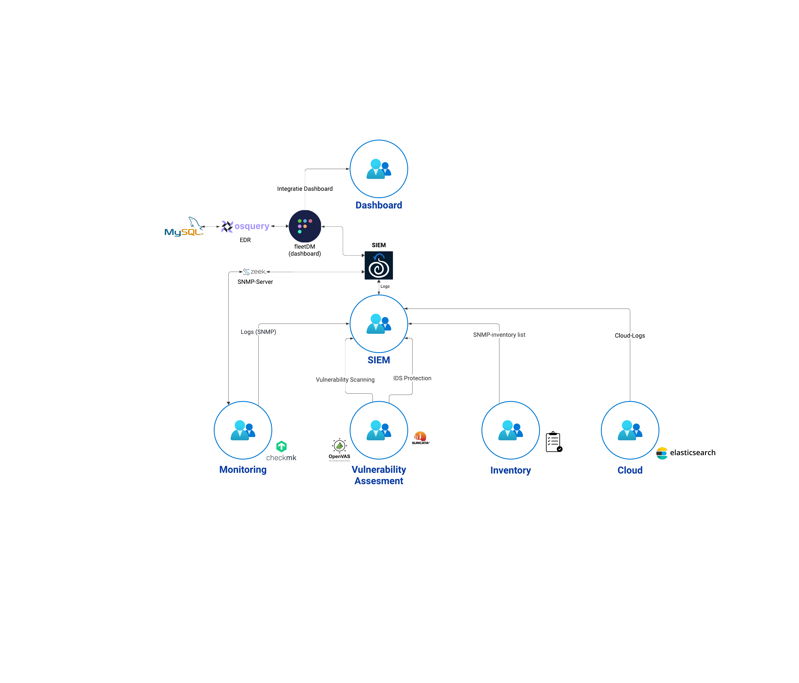
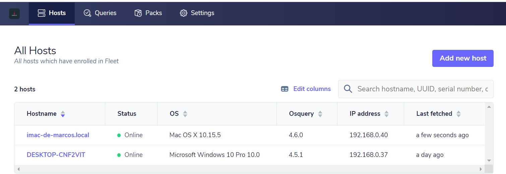

# Werking van de SIEM

## SIEM schema


### Monitoring
#### Monitoring van infrastructuur via SNMP (CheckMK)
De volledige infrastuctuur zal worden gemonitord worden doormiddel van CheckMK. Dit programma zal met behulp van het SNMP protocol , SNMP traps verzamelen en vervolgens doorsturen met behulp van een API naar de SNMP server die zal opgezet worden met behulp van Zeek. Zeek draait binnen in de Security Onion en zal een lijst bevatten met de meest voorkomende apparaten binnen de infrastructuur met bijhorende config. 

Het Opzetten van CheckMK zal gebeuren door het monitoring team.

### Vulnerability Assesment
#### Vulnerability Scanner (OpenVAS)
Voor Vunerability Scanner zal er OpenVAS gebruikt worden. Deze zal doormiddel van automatisch scans kwetsbaarheden vastleggen in de infrastructuur en indien nodig het systeem alarmeren. De data van deze scanner zal worden geanalyseerd worden in de SIEM. Het formaat van deze data is standaard XML maar kan ook worden geconverteerd naar een JSON. 

Hiervoor zal het Vulnerability Assesment team verantwoordelijk zijn.

#### IDS (Snort/Suricata)

### Inventory
De Inventory zal een lijst zijn met bijhorende configuratie zijn voor een goede werking over SNMP te garanderen. Deze lijst zal opgesteld worden door het Alerting team. 

### CLOUD

### SIEM
#### EDR security (OsQuery)
Osquery is een makkelijk te gebruiken monitoring tool dat gebruik maakt van SQL om alle verkregen informatie van operating systems samen te vatten in een relationele database. 
Osquery ondersteund Windows, macOS en linux OS.

De naam os query verteld eigenlijk letterlijk wat het programma doet. "Osquery lets you query OSs like a database". Het maakt gebruik van basis SQL commands om deze vragen te stellen over apparaten.

Het is snel en lightweight. Osquery is perfect om te gebruiken voor het monitoren van devices voor real-time data.
Enkele manieren voor vulnerability management met Osquery : 
- Check voor slechte security configuratie
- ongewilde malicious applicatie of extenties
- Controleer de status van firewalls verifieren
- Controleer op verouderde of kwetsbare besturingssysteem- en softwareversies.

##### Osquery voor macOS vs Windows vs Linux
Voor macOS-systemen kun je bijvoorbeeld informatie ophalen over geïnstalleerde applicaties, draaiende processen, netwerkverbindingen, bestandssysteemactiviteit en meer. Specifieke zaken zoals toegangsrechten, firewallinstellingen en systeeminstellingen kunnen ook worden gecontroleerd.

Bij windows komt hier nog bij dat je informatie kunt verzamelen over Windows-services, registervermeldingen, geplande taken, gebruikersactiviteit en meer.

Bij de verschillende operating systems zijn de basisprincipes hetzelfde. Echter kunnen specifieke query's verschillen.

Enkele voorbeelden van de verschillende query's.
```
Voor het ophalen van informatie over geïnstalleerde applicaties:

- macOS: SELECT name, bundle_identifier, version FROM apps;
- Windows: SELECT name, version FROM programs;
- Linux: SELECT name, version FROM rpm_packages;

Voor het ophalen van informatie over draaiende processen:

- macOS: SELECT name, path, pid FROM processes;
- Windows: SELECT name, path, pid FROM processes;
- Linux: SELECT name, cwd, pid FROM processes;
```
De verschillen in deze query's staan goed gedocumenteerd en zijn makkelijk te vinden. Echter is het wel  belangrijk om bij het opstellen van de queries rekening te houden met deze verschillen, om steeds de juiste en meest relevante informatie te verkrijgen. 

#### Dashboard (FleetDM)
FleetDM, of Fleet, is een open-source tool ontwikkeld door Kolide. Het is een gecentraliseerd beheerplatform voor osquery, een open-source framework voor de beveiliging van endpoints dat query's (vragen) en monitoring van endpoints mogelijk maakt met behulp van SQL-achtige query's (vragen). 

Fleet zorgt voor een webinterface, hier gaan we de data die we hebben verkregen met osquery op visualiseren. 
Fleet werkt met een query libary van vragen. Wat houdt dit in : je stelt eigenlijk vragen aan de osquery in hetzelfde formaat als mySQL.

Bijvoorbeeld :
Wat operating system is geinstalleerd op mijn apparaat?
```
1. SELECT * FROM os_version
```
Je kan voor elke endpoint een verschillende query opstellen.

### Hoe wordt de informatie weergegeven?
Nadat je de query's hebt opgesteld in het FleetDM-dashboard en deze hebt toegewezen aan de gewenste endpoints, zal FleetDM de query's naar die endpoints distribueren. De Osquery-agent zal op elke endpoint de toegewezen query uitvoeren, de informatie verzamelen en de gekregen resultaten terugsturen naar het FleetDM dashboard.

De resultaten van de uitgevoerde query's worden gepresenteerd in het FleetDM-dashboard. Je kunt verschillende weergaven gebruiken, zoals tabellen, grafieken of grafieken om de data te visualiseren.

Kijk het gegeven voorbeeld : 


Dit dashboard zal later worden geïntgreerd in een algemeen dashboard opgesteld door het dashboard team. 

#### SNMP server (Zeek)


## Waar schiet de SIEM te kort ? 
Security Onion is een zeer krachtige SIEM-oplossing waarin veel verschillende stukken software/technologieën kunnen worden in geïntgereerd worden. Echter heeft deze oplossing een zeer groot nadeel, het gebruikt zeer veel resources:
- 16 GB RAM minimum
- 200 GB Opslag minimum
- 4 CPU kernen minimum

Hierdoor is het zeer moeilijk om de ISO van Security Onion lokaal op een hypervisor te draaien zeker als de pc niet voldoende resources heeft , dan zal de VM crashen tijdens de installatie ookal compenseer je het te kort aan RAM met een swap-file. 

### eventuele oplossingen voor deze tekortkomingen 
Voorzie een PC of VM met voldoende resources. 

# Problemen 
## SOC dashboard was onbereikbaar.
Het was onmogelijk om de via jumphost het dashboard van de Security Onion Console (SOC) te bereiken zelfs met local portfowards. Er gingen twee zaken fout de firewall van Security Onion liet niet toe dat er verkeer werd gestuurd naar het dashboard. Nadat deze werd afgezet kon er enkel de homepage van nginx bereikt worden terwijl de de nginx normaliter zou moeten redirecten naar de SOC. 

Als test is er rechtstreeks gesurft naar het IP van de SOC op het bletchley netwerk zonder gebruik maken van de jumphost. Hier werkt de redirect naar het SOC dashboard naar behoren. Zo hebben we kunnen besluiten dat de jumphost of jumphost configuratie niet goed is ingesteld waardoor het dashboard onbereikbaar was. 

Aangezien wij als SIEM-team geen invloed hebben op de in

# Hoofdvragen 
## Welke SIEM? (alternatieven vergelijken) 
Er zijn verschillende soorten SIEMS op markt. Sommige zijn open-source andere weer niet. Voor dit project moet de SIEM aan volgende vereisten  voldoende:
- frequente updates
- schaalbaar
- open-source
- zoveel mogelijk technologieen ondersteunen en kunnen intgreren

Bij onderzoek werden volgende Open-source SIEMS vergeleken
- Graylog
- Security Onion
- Alienvault OSSIM
- Wazuh

## Graylog
Graylog is een SIEM met zijn eigen logcollector die gebruikt maakt van verschillende Technologieën waaronder Elasticsearch en MongoDB.

De SIEM is zeer flexibel in verschillende scenarios en relatief eenvoudig op te zetten. Daarnaast biedt het extreem veel filter mogelijkheden voor geavanceerde loganalyses te kunnen uitvoeren. 
Echter is deze SIEM niet de beste keuze aangezien er problemen kunnen optreden bij grotere implementaties. Verder is ook niet veel support beschikbaar voor deze SIEM. 

## AlienVault OSSIM
OSSIM is veel geavanceerdere SIEM T.O.V. Graylog. Naast het gebruik van ELasticsearch maakt de SIEM ook gebruikt van onder meer Snort en OpenVAS. Hierdoor is mogelijk om meer logs binnen het netwerk te verzamelen en ook aan vulnerability assesment te doen. Jammer genoeg zijn enkele functies betalend waardoor je SIEM niet volledig open-source kunt gebruiken. 

## Security Onion
Security Onion is een all-in-one SIEM die zeer diverse technologieën "zoals Suricata , snort , zeek , ..." combineerd tot één geheel. De SIEM is netwerk gefocust (routers/switches/Netwerk Traffic) waardoor je hele netwerk zeer goed kunt monitoren. Daarnaast biedt de SIEM ook Host-based functies waarmee de Hosts kunnen gemonitord worden. 

Echter heeft de SIEM één groot nadeel, Hij gebruikt zeer veel resources (200GB opslag , 16GB RAM 4CPU cores). Maar dit compenseerd de SIEM wel met zijn mogelijkheden. Idealiter zouden wij deze SIEM willen gebruiken , maar moest het niet mogelijk zijn omwille van de resources gebruiken we Wazuh als alternatief. 

Testen hiermee is ook lastig want de meeste van ons hebben deze resources niet zomaar tot beschikking. 

## Wazuh

Wazuh is een SIEM waarmee we hebben kennisgemaakt binnen de school. Het is Redelijke eenvoudige SIEM die met behulp ELK-stack zijn logs genereerd en analyseerd. De SIEM zelf is zeer lightweight en is Integreerbaar met verschillende andere Technologieën. Belangrijk is wel op te merken dat Wazuh een beperkte schaalbaarheid heeft en het soms moeilijk kan zijn om de juiste regels te creëren.

Wazuh is een host-based SIEM. Wat betekend dat de SIEM-oploosing zich focust op het bewaken en analyseren van de individuele hosts/endpoints binnen een netwerk. 

### conclusie
De beste keuze zou Security Onion zijn voor dit project. De SIEM heeft grote set aan tools tot zijn beschikking om het netwerk te monitoren. Het nadeel is dat deze SIEM-oplossing zeer veel resources vraagt. 

Indien het niet mogelijk is om deze resources vrij te maken zal de keuze eerder vallen op wazuh. Deze SIEM-oplossing zeker een goed alternatief voor Security Onion. Maar dan is het ook zeer belangrijk om te controleren waar deze SIEM te kortkoming heeft en deze op te lossen zijn. 


# Hoe mobile clients controleren? (EDR) 
Bij EDR gaan we gebruik maken van Osquery, deze wordt door zowel wazuh als security onion ondersteund. Wazuh heeft een ingebouwde osquery module voor de wazuh agents. Die staat toe de Osquery in te stellen en data te verzamelen die gegenereerd is door de Osquery en deze dan door te sturen naar de manager.

Bij security onion wordt er gebruik gemaakt van FleetDM. FleetDM is een opensource tool die wordt gebruikt als een centraal management platform gebruikt voor Osquery.

Securety onion maakt gebruik van Launcher als management wrapper rond osquery.

In Security Onion is "Launcher" een component of hulpprogramma ontworpen om de implementatie, configuratie en uitvoering van Osquery op uw netwerk of endpoints te beheren.

Een managementwrapper is een softwarelaag of -interface die rond een ander stuk software zit om extra beheermogelijkheden te bieden, waardoor de beheertaken met betrekking tot die software vereenvoudigd worden. 
Launcher bekijkt elk uur of er een update beschikbaar is, zo ja zal deze gedownload worden en geinstalleerd worden.

Het kibana dashboard gaat een overview geven van de osquery logs in het systeem.


# Hoe logs van switches en routers opvragen? (syslog) 

Syslog laat een netwerk node toe om logs van zijn systeem naar een ander systeem te sturen dat een syslog daemon draait, deze syslog service slaagt de logs op in bestanden. Hiervoor is er een server nodig die een syslog daemon draait, deze logs moeten dan worden doorgestuurd naar onze SIEM server door middel van een client agent of door de syslog daemon op de SIEM server zelf te laten draaien. Elke router en switch moet worden ingesteld zodat ze hun logs versturen naar de centrale server. 

 
*Procedure om syslog op switches en routers in te schakelen:* 
Er zijn meerdere opties om de logs van switches en routers naar een centraal systeem te sturen.  

We kunnen SNMP gebruiken om syslogs van het netwerk apparaat door te sturen naar de snmp-server host. Deze snmp server zou in principe op de SIEM kunnen draaien, hiervoor moeten de syslogs als traps worden verstuurd naar de snmp server. Traps zijn pakketjes die onmiddelijk bij het aanmaken worden doorgestuurd. Security Onion bevat zelf een snmp agent, bij wazuh zou deze nog eens opgezet moeten worden.

We kunnen ook ansible gebruiken om zo voor elke vendor een aparte playbook te schrijven die de syslogs direct doorstuurt naar de SIEM server. Voor Cisco switches bestaat er bijvoorbeeld een ansible module die ons toelaat dit in te stellen. Dit vereist verschillende playbooks per vendor en is dus een complexer alternatief.

Of elke switch en router wordt manueel ingesteld om zijn logs te sturen naar de SIEM server. Dit vereist heel veel manueel werk en laat ons niet toe om de omgeving snel op te zetten.

Switches en Routers moeten worden opgezet om alle logs naar de siem te versturen. Als we het netwerk monitoren met Zeek, dan zal deze alle syslogs loggen ookal waren deze niet voor deze SIEM bedoelt.


# Hoe OVA up to date houden? 

Er wordt een ansible file geschreven die controleert of we de meest recente versie van de SIEM hebben, bij een outdated versie pullen we de nieuwste versie en wordt deze lokaal binnengehaald. De OVA wordt dan gedeployed en alle ansible scripts die nodig zijn om het netwerk correcct in te stellen worden uitgevoerd.
# Bronnen
### wazuh
https://wazuh.com/
### Security Onion
https://securityonionsolutions.com/
### OSSIM
https://cybersecurity.att.com/
### Graylog
https://graylog.org/
### Syslog
https://www.cisco.com/c/en/us/td/docs/switches/metro/me1200/controller/guide/b_nid_controller_book/b_nid_controller_book_chapter_010101.pdf 
### Osquery
https://fleetdm.com/guides/osquery-a-tool-to-easily-ask-questions-about-operating-systems
https://docs.securityonion.net/en/2.3/osquery.html
### FleetDM
https://fleetdm.com/docs/using-fleet/learn-how-to-use-fleet
https://medium.com/@itdanny/security-onion-part-2-tools-1cd95e350811
https://docs.securityonion.net/en/2.3/fleet.html#fleet


