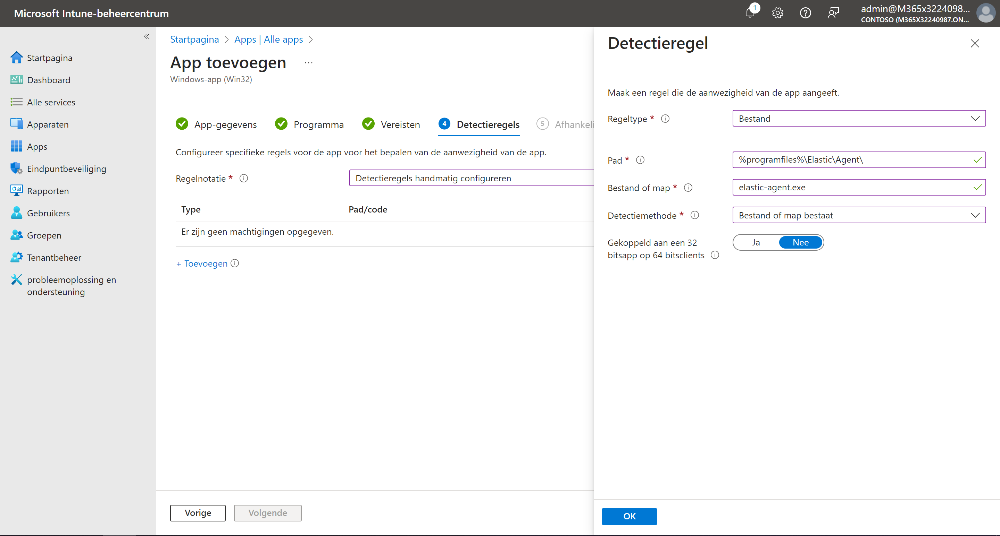

# Installeren Elastic Agents via Microsoft Intune

### Inleiding
In dit document wordt beschreven hoe Elastic Agents op alle apparaten via Microsoft intune worden ingeschreven. In een bedrijfsomgeving wordt microsoft intune vaak gebruikt om apparaten binnen dat bedrijf te beheren, daarom maken wij gebruik van deze tool om SIEM security uit te rollen op alle apparaten binnen het bedrijf.

### Voorbereiding
We gaan ervan uit dat apparaten al zijn opgezet en in het intune platform beschikbaar zijn als volgt.

### Elastic Agent Downloaden en klaarmaken
Eerst moet de Elastic Agent worden gedownload op de computer van de intune administrator via de volgende link: 
https://10.180.180.180/#/downloads

Download de elastic agent installer steeds via Security Onion.

We moeten de .exe die we hebben gedownload nu converteren naar een .intunewin file, met dit bestandstype kunnen we de Elastic Agent deployen over meerdere machines. Om te converteren hebben we de [Microsoft-Win32-Content-Prep-Tool](https://github.com/Microsoft/Microsoft-Win32-Content-Prep-Tool)
nodig van Microsoft. 

Selecteer de elastic-agent.exe als setup file vanuit de juiste source folder. De destination folder bepaald waarin de .intunwin file zal worden aangemaakt.

### Intunewin deployen
Nu kunnen we via [intune](https://intune.microsoft.com/) onze .intunewin deployen op alle machines. 

Maak een nieuwe app aan en selecteer Windows-app (Win32)

Kies de elastic-agent.intunewin file die we net hebben aangemaakt.

Vul de gevraagde gegevens in.

Stel handmatige detectieregels in als volgt.

Afhankelijkheden en Vervanging mag je overslaan, bij Toewijzingen kies je de groepen/apparaten waarop de elastic agent moet worden geinstalleerd.

Beoordeel en voeg de app toe.

### Resultaat
Na een bepaalde tijd zal je bij het overzicht van de app zien dat deze is geinstalleerd op alle apparaten.

We kunnen op de windows machines ook een kijken of we de files werkelijk terugvinden.

We controleren onze elastic fleet en zien daarop ook onze devices staan.

### Conclusie
Het installeren van Elastic Agents via Intune zorgt voor een makkelijke integratie binnen een bedrijf omdat deze al vaak werken met de software. Nadat we de agents hebben geinstalleerd zullen we logs van deze devices binnenkrijgen op de Security Onion wat een administrator toelaat om verdachte activiteiten te controleren.

### Bronnen
Ooi, E. (2023, December 15). Elastic Explained: How To Deploy Elastic Agent on Windows with Microsoft Intune. Ooi Ventures. https://ooiventures.com/elastic-explained-how-to-deploy-elastic-agent-on-windows-with-microsoft-intune/